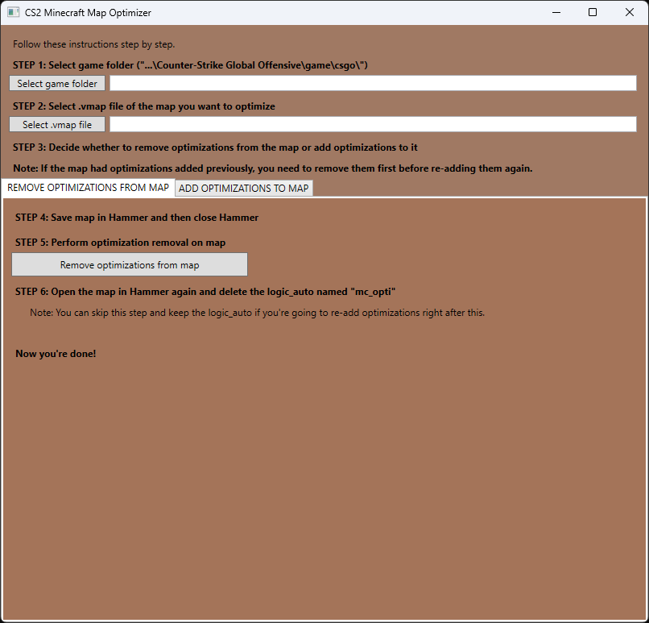

## CS2 Minecraft Map Optimizer

Made for [Lillykyu's Minecraft-themed Counter-Strike 2 map](https://steamcommunity.com/sharedfiles/filedetails/?id=3172495446). That map has over 8000 "blocks" (func_breakable entities) pushing the game engine to the limit.

This tool was an attempt to improve the game client's FPS by hiding some of the inner blocks of the map that are obstructed by the outermost block layer.

It roughly achieves a 10 to 20 percent FPS improvement on the game client. Over 2000 out of ~8000 blocks get hidden in the current version of the map.

    
    

### How

A block gets hidden if all 6 of its neighbors are opaque, full blocks. Special case: Blocks on the ocean see the ocean as a a neighbor too.

Once a hidden block's neighbor is destroyed, the hidden block is made visible.

This tool has 2 semi-automatic operations:
- **Adding optimizations to map**. This means:
    - Determining hidden blocks
    - Naming the hidden blocks "mc_opti_XXX"
    - Setting up OnBreak outputs in their neighbors for making the hidden blocks visible
    - Additionally, you need to manually create a logic_auto that hides the blocks on round start
- **Removing optimizations from map**. This means:
    - Removing the "mc_opti_XXX" names from hidden blocks
    - Removing the OnBreak outputs that make hidden blocks visible
    - Additionally, you need to manually delete the logic_auto

This tool has no idea which blocks are opaque full blocks, and which are not. It assumes every func_breakable without a targetname is an opaque full block.

In theory, all func_breakable's that aren't opaque and full blocks (e.g. fences, slabs, stairs, glass, leaves) need to be named. But it's sufficient to only name the few ones that cause problems and then re-run the tool.

### Implications

- After optimizations, you can freely add more blocks without creating bugs.
- After optimizations, you CANNOT move or delete blocks that were present during optimization without creating bugs.
    - So, after moving or deleting some blocks, **remove the optimizations from the map**, and then **add the optimizations** again using the tool.
- This tool _can_ corrupt the VMAP file. I was very careful and didn't see it happen, but I make no guarantees. That's why the tool _always_ creates a timestamped backup of the VMAP file before modifying it.
- This tool's operations can take a while to complete, it appears frozen throughout. Be patient and read its console output.

### Acknowledgements

Huge thanks to JimWood for providing the VMAP file parser: https://www.nuget.org/packages/KeyValues2Parser/

### Licensing

Do whatever you want with it
